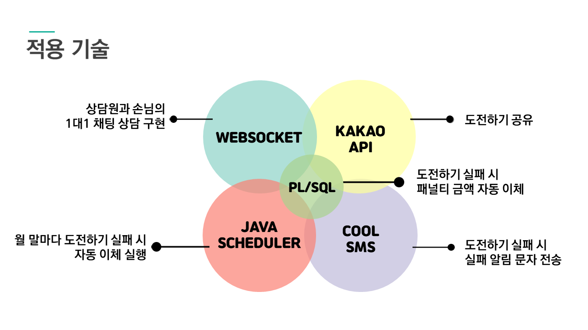

# FUN하게 저축하자! 하나챌린지

[프로젝트 홈페이지](https://koposoftware.github.io/2022_4_smpark/)

# 1. 프로젝트 소개
[프로젝트 제안서](/제안서_2260341005_박수민.pptx) 
## 1-1. 개발환경
- OS : window10
- Language : JAVA, Javascript, JQuery, html, css  PL/SQL
- Tool : Sql Developer, Spring Boot
- DBMS : Oracle DBMS

## 1-2. 프로젝트 개요 및 목적

-	저축은 지루하고 유지하기 힘들다는 인식에서 벗어나 원하는 소비를 하면서도 저축을 할 수 있는 금융서비스를 기획하였습니다. 하나챌린지 서비스는 손님들의 선호에 맞는 금융상품 소개를 위한 소비패턴 분석과 도전을 통한 절약, 다양한 기업간의 제휴를 통해 적금 만기를 위한 동기를 부여합니다.
 

## 1-3. 프로젝트 기대효과

## 1-4. 프로젝트 일정

# 2. 프로젝트 구성 
## 2-1. 시스템 아키텍처

## 2-2. 서비스 아키텍처

## 2-3. 기능리스트

## 2-4. 적용 기술

## 2-5. ERD

# 3. 프로젝트 결과

## 3-1. 발표 ppt 
[발표 PPT](/project.pptx) 

## 3-2. 시연 영상 

  <iframe width="424" height="238" src="https://www.youtube.com/embed/reOGfxYJre0" title="YouTube video player" frameborder="0" allow="accelerometer; autoplay; clipboard-write; encrypted-media; gyroscope; picture-in-picture" allowfullscreen></iframe>

# 4. 자기 소개

| 이름 | 박수민 |  |
| :--- | :--- | :--- |
| 메일 | <cjstk4_@naver.com>  |  |
| Language & Tools | JAVA, Javascript, JQuery, html, css, PL/SQL  | |
| Database | Oracle DBMS  | |
| Etc | Sql Developer, Spring Boot| |
| 자격증 | SQLD | 2022.06 | 
|  | 정보처리기사(필기) | 2021.08 | 
|  | 컴퓨터활용능력1급 | 2021.05 | 
| 대외활동 | 한이음 ‘금융약자 청소년 대상 마이데이터를 활용한 공모주 주가변동 AI 예측 플랫폼’ 선정 | 2022.03 - 2022.11 | 
| 교육활동 | 하나금융티아이 채용전환형 교육 ( 한국폴리텍대학교 광명융합기술교육원 - 데이터분석과 ) | 2022.03 - 2022.10 | 

