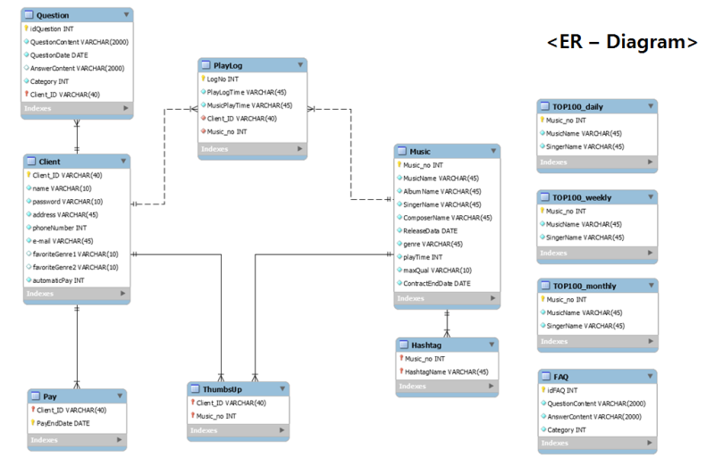

# 프로젝트 제목

[프로젝트 홈페이지](https://koposoftware.github.io/2022_4_smpark/)

# 1. 프로젝트 소개
[프로젝트 제안서](/제안서_2260341005_박수민.pptx) 
## 1-1. 개발환경
- OS : window10
- Language : JAVA, Javascript, JQuery, html, css  PL/SQL
- Tool : Sql Developer, Spring Boot
- DBMS : Oracle DBMS

## 1-2. 프로젝트 개요 및 목적

-	저축은 지루하고 유지하기 힘들다는 인식에서 벗어나 원하는 소비를 하면서도 저축을 할 수 있는 금융서비스를 기획하였습니다. 하나챌린지 서비스는 손님들의 선호에 맞는 금융상품 소개를 위한 소비패턴 분석과 도전을 통한 절약, 다양한 기업간의 제휴를 통해 적금 만기를 위한 동기를 부여합니다.
 

## 1-3. 프로젝트 기대효과

## 1-4. 프로젝트 일정

# 2. 프로젝트 구성 
## 2-1. 시스템 아키텍처

 
## 2-2. 서비스 아키텍처

 
## 2-3. 기능리스트

## 2-4. 적용 기술
                
## 2-5. ERD

# 3. 프로젝트 결과
프로젝트 결과를 추가하세요. 발표자료. 시연동영상을 추가하세요.
    
   
    
## 발표 ppt 

[발표자료](/project.pptx) 
## 시연 동영상 

  <iframe width="424" height="238" src="https://www.youtube.com/embed/reOGfxYJre0" title="YouTube video player" frameborder="0" allow="accelerometer; autoplay; clipboard-write; encrypted-media; gyroscope; picture-in-picture" allowfullscreen></iframe>

# 4. 기타
그외 프로젝트를 더욱 설명할수 있는 것들을 추가하세요
 
# 5. 본인 소개

본인 소개를 추가하세요

|이름 |고길동||
|연락처 | gdko(@)kopo.ac.kr|
|skill set| Frontend - HTML, CSS, Javascript|
| | Backend - Java, Spring, Oracle|
|자격증| 20xx년 정보처리기사 |
|| 20xx년 빅데이터분석기사 |
|| 20xx년 SQLD |
|| 20xx년 ADsP |
|수상| 20xx년 ICT 멘토링 프로젝트 대상 수상 (과학기술정보통신부 지원)  |
| | 20xx년 한국폴리텍대학 벤처창업아이템경진대회 대상 수상 (고용노동부 후원)  |
| | 20xx년 금융데이터경진대회 금상 수상|
| | 20xx년 대학생 논문 경진대회 은상 수상|
|특기사항|  TOEIC 990 |
||  리니지 만랩 |

